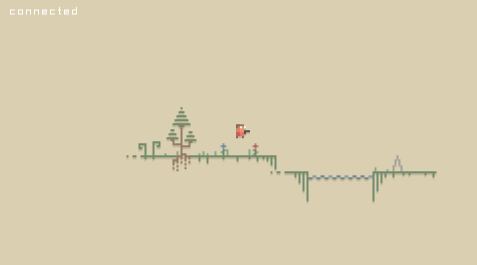

# Lem

a cute little networked multiplayer demo for XNG (XNez + Glint + Glint.Networking)



## build

get library submodules:
```sh
git submodule update --init --recursive # update submodules
```

### debug

```sh
cd src/Lem/Lem/
dotnet run -- -Cplatform.verbosity=4
```

### release

```sh
./script/build_arc.sh <runtime> # ex. one of linux-x64, osx-x64, win-x64
```

## running

run `./Lem`.
add `-Cplatform.verbosity=4` and `-Cnet.debug=true` to get more detailed network logs.
pass `--server` to run the server instead of the client.

## license

Source: Copyright &copy; 2020 xdrie. Licensed under the [MIT License](LICENSE).

Assets: [Paper Pixels](https://v3x3d.itch.io/paper-pixels) by VEXED. Licensed under the CC0 v1.0 Universal.
